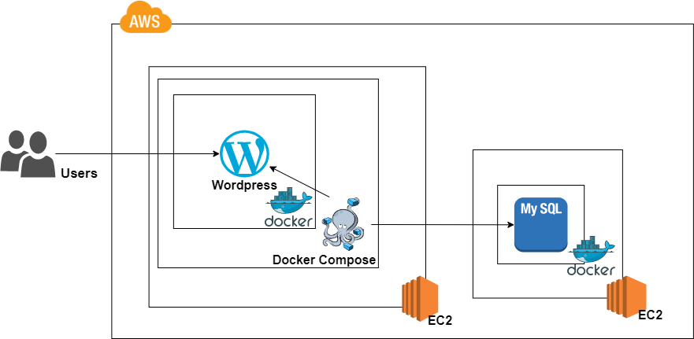

<h1 align="center">Build WordPress on AWS with Terraform</h1>
<p align="center">
  <a href="https://github.com/PARKINHYO/WordPress-Terraform">
    
  </a>  
  <a href="https://github.com/PARKINHYO/corona-kakao-bot/blob/master/README.md" target="_blank">
  </a>
  <a href="https://github.com/PARKINHYO/WordPress-Terraform/blob/main/LICENSE" target="_blank">
    
  </a>  
  <a href="https://github.com/PARKINHYO/WordPress-Terraform/actions/workflows/terraform.yml" target="_blank"></a>
</p>

<p align="center">

</p>

<p align="center">
테라폼을 학습하기 위해 AWS에 WordPress를 구축하는 작은 프로젝트를 진행했습니다. 테라폼 공식 모듈을 사용했고, GitHub Actions로 CI/CD를 구성했습니다.
</p>

--------

## ✔ 요구사항

### VPC

|VPC|No|Subnet|CIDR|Route Table|gateway|
|:----|:----|:----|:----|:----|:----|
|tf-vpc-singa-wp-inhyo<br>(10.70.0.0/16)|1|tf-sub-singa-wp-bast-inhyo-a|10.70.11.0/16|tf-rt-singa-wp-bast-inhyo|tf-igw-singa-wp-inhyo|
| |2|tf-sub-singa-wp-bast-inhyo-b|10.70.12.0/16|tf-rt-singa-wp-bast-inhyo|tf-igw-singa-wp-inhyo|
| |3|tf-sub-singa-wp-app-inhyo-a|10.70.21.0/16|tf-rt-singa-wp-app-inhyo|tf-nat-singa-wp-inhyo|
| |4|tf-sub-singa-wp-app-inhyo-b|10.70.22.0/16|tf-rt-singa-wp-app-inhyo|tf-nat-singa-wp-inhyo|
| |5|tf-sub-singa-wp-db-inhyo-a|10.70.31.0/16|tf-rt-singa-wp-db-inhyo|none|
| |6|tf-sub-singa-wp-db-inhyo-b|10.70.32.0/16|tf-rt-singa-wp-db-inhyo|none|


### Security Group

**Bastion**

|Name|tf-singa-wp-bastion-sg-inhyo|Inbound| | | | | |
|:----|:----|:----|:----|:----|:----|:----|:----|
| | |**IP version**|**Type**|**Protocol**|**Port**|**Source**|**Description**|
| | |IPv4|SSH|TCP|22|x.x.x.x/32|Home|
| | |**Outbound**| | | | | |
| | |**IP version**|**Type**|**Protocol**|**Port**|**Source**|**Description**|
| | |IPV4|all|all|all|0.0.0.0/0|-|
| | |IPv6|all|all|all|::/0|-|

**DB**

|Name|tf-singa-wp-db-mysql-sg-inhyo|Inbound| | | | | |
|:----|:----|:----|:----|:----|:----|:----|:----|
| | |**IP version**|**Type**|**Protocol**|**Port**|**Source**|**Description**|
| | |IPv4|MYSQL/Aurora|TCP|3306|10.70.21.0/24|tf-sub-singa-wp-app-inhyo-a|
| | |IPv4|MYSQL/Aurora|TCP|3306|10.70.22.0/24|tf-sub-singa-wp-app-inhyo-b|
| | |**Outbound**| | | | | |
| | |**IP version**|**Type**|**Protocol**|**Port**|**Source**|**Description**|
| | |IPV4|all|all|all|0.0.0.0/0|-|
| | |IPv6|all|all|all|::/0|-|

|Name|tf-singa-wp-db-ssh-sg-inhyo|Inbound| | | | | |
|:----|:----|:----|:----|:----|:----|:----|:----|
| | |**IP version**|**Type**|**Protocol**|**Port**|**Source**|**Description**|
| | |IPv4|SSH|TCP|22|10.70.21.0/24|tf-sub-singa-wp-app-inhyo-a|
| | |IPv4|SSH|TCP|22|10.70.22.0/24|tf-sub-singa-wp-app-inhyo-b|
| | |IPv4|SSH|TCP|22|10.70.11.11/32|bastion local ip address|
| | |**Outbound**| | | | | |
| | |**IP version**|**Type**|**Protocol**|**Port**|**Source**|**Description**|
| | |IPV4|all|all|all|0.0.0.0/0|-|
| | |IPv6|all|all|all|::/0|-|

**ALB**

|Name|tf-singa-wp-alb-http-sg-inhyo|Inbound| | | | | |
|:----|:----|:----|:----|:----|:----|:----|:----|
| | |**IP version**|**Type**|**Protocol**|**Port**|**Source**|**Description**|
| | |IPv4|HTTP|TCP|80|0.0.0.0/0|HTTP|
| | |**Outbound**| | | | | |
| | |**IP version**|**Type**|**Protocol**|**Port**|**Source**|**Description**|
| | |IPV4|all|all|all|0.0.0.0/0|-|
| | |IPv6|all|all|all|::/0|-|

**ASG**

|Name|tf-singa-wp-asg-sg-inhyo|Inbound| | | | | |
|:----|:----|:----|:----|:----|:----|:----|:----|
| | |**IP version**|**Type**|**Protocol**|**Port**|**Source**|**Description**|
| | |IPv4|HTTP|TCP|80|0.0.0.0/0|tf-singa-wp-alb-http-sg-inhyo|
| | |IPv4|SSH|TCP|22|10.70.11.11/32|bastion local ip address|
| | |**Outbound**| | | | | |
| | |**IP version**|**Type**|**Protocol**|**Port**|**Source**|**Description**|
| | |IPV4|all|all|all|0.0.0.0/0|-|
| | |IPv6|all|all|all|::/0|-|


### resource

**EC2**

|Account|No|Instance Name|Instance Type|OS|IPv4(Int)|IPv4(Ext)|Subnet|Security Group|Storage(GB)|Keypair|
|:----|:----|:----|:----|:----|:----|:----|:----|:----|:----|:----|
|global-demo(959411157271)|1|tf-singa-wp-bastion-pub-inhyo|t2.nano|Ubuntu Server 20.04 LTS|10.70.11.11|x.x.x.x|tf-sub-singa-wp-bast-inhyo-a|tf-singa-wp-bastion-sg-inhyo |8| tf-singa-wp-keypair-pub-inhyo|
|global-demo(959411157271)|2|tf-singa-wp-app-pri-inhyo|t2.micro|Ubuntu Server 20.04 LTS|-|-|tf-sub-singa-wp-app-inhyo-a|tf-singa-wp-asg-sg-inhyo |8|tf-singa-wp-keypair-app-inhyo|
|global-demo(959411157271)|3|tf-singa-wp-db-pri-inhyo|t2.micro|Ubuntu Server 20.04 LTS|10.70.31.31|-|tf-sub-singa-wp-db-inhyo-a|tf-singa-wp-db-ssh-sg-inhyo, tf-singa-wp-db-mysql-sg-inhyo| 8|tf-singa-wp-keypair-db-inhyo|

**ALB**

|Name|VPC|Subnet|Availibility Zone|Port|Protocol|Security Group|
|:----|:----|:----|:----|:----|:----|:----|
|tf-singa-wp-alb-inhyo|tf-vpc-singa-wp-inhyo|tf-sub-singa-wp-bast-inhyo-a, <br>tf-sub-singa-wp-bast-inhyo-b|ap-southeast-1a, <br>ap-southeaast-1b|80|HTTP|tf-singa-wp-alb-bastion-sg-inhyo, <br>tf-singa-wp-alb-http-sg-inhyo|

**ASG**

|Name|VPC|Subnet|Min|Max|Image ID|Instance Type|Security Group|Keypair|
|:----|:----|:----|:----|:----|:----|:----|:----|:----|
|tf-singa-wp-lt-inhyo|tf-vpc-singa-wp-inhyo|tf-sub-singa-wp-app-inhyo-a, <br>tf-sub-singa-wp-app-inhyo-b|1|s|ami-09f36c6434f043b29|t2.micro|tf-singa-wp-asg-sg-inhyo|tf-singa-wp-keypair-app-inhyo|

## 💡 Architecture

<p align="center">
 
</p>


## 📎 Application

<p align="center">
 
</p>

## 💻 테스트

### 사전 준비사항

* 테라폼 학습 : https://learn.hashicorp.com/tutorials/terraform/infrastructure-as-code?in=terraform/aws-get-started
* 테라폼 + GitHub Actions : https://learn.hashicorp.com/tutorials/terraform/github-actions 

### 테라폼 개발 시 참고

* 테라폼 클라우드 : https://app.terraform.io/ 
* 테라폼 레지스트리 : https://registry.terraform.io/ (리소스 및 공식 모듈 검색)
* 테라폼 모듈 소스코드 : https://github.com/terraform-aws-modules 
* 테라폼 업앤러닝 소스코드 : https://github.com/brikis98/terraform-up-and-running-code/tree/master/code/terraform
* etc..

### AMI 이미지 만들기

**WordPress AMI**
1. public한 ec2에서 구축
1. 도커 설치 : https://docs.docker.com/engine/install/ubuntu/ 
2. 도커 컴포즈 설치 : ihp001.tistory.com/199 (버전 1.29.2로 설치)
3. docker-compose.yml 파일 : [docker-compose.yml](./docker-compose.yml)
   * 비밀번호 설정
   ```bash
   $ docker-compose up -d # 시작

   $ docker-compose down # 종료
   $ docker ps # 상태 확인
   $ docker logs (컨테이너 이름) # 로그 확인
   $ docker exec -it (컨테이너 이름) /bin/bash # 컨테이너 쉘 접속
   ```
4. `docker ps`로 컨테이너 상태 확인 후 웹 접속하여 database error가 뜨면 AMI 만들기
   * 

**MySQL AMI**
1. WordPress 만들었던 서버에서 WordPress 이미지 생성이 완료되면 해당 서버에서 진행
2. 컨테이너 종료 & 이미지 삭제
   ```bash
   $ docker-compose down # wordpress 컨테이너 종료 및 삭제
   $ docker rmi (이미지 이름) # wordpress 이미지 삭제
   ```
3. MySQL 컨테이너 실행
   * 참고 : poiemaweb.com/docker-mysql
     ```bash
     $ docker run --name mysql-container -e MYSQL_ROOT_PASSWORD=<password> -d -p 3306:3306 mysql:latest
     $ docker ps -a
     ```
4. MySQL 클라이언트 설치, 접속 확인, 데이터베이스 생성, 권한 설정
   ```bash
   $ apt-get install mysql-client -y
   $ mysql -V # 설치 확인
   $ sudo mysql -h 127.0.0.1 -u root -p
   # 비번 입력
   mysql> create database wordpress;
   mysql> grant all privileges on *.* to 'root'@'%' identified by '비밀번호';
   # root, %, 비밀번호에 작은 따옴표도 포함해서 입력
   # root에 모든 IP 대역, 모든 권한 허용
   mysql> flush privileges; # 쿼리 적용
   mysql> quit; 
   ```
   * wordpress 데이터베이스를 만들었고, wordpress ec2 서버에서 DB 서버에 접근 가능
5. 서버 reboot시에 MySQL 컨테이너 자동 시작 설정
   ```bash
   $ docker update --restart=always mysql-container
   $ sudo reboot
   $ docker ps # 컨테이너가 자동으로 올라가나 확인
   ```
6. AMI 만들기

### 테라폼 클라우드 환경 변수 설정(keypair)

1. 로컬에서 ssh-keygen을 통해 pub, pri key 생성
   ```bash
   $ ssh-keygen -t rsa -b 4096 -N "" -f bastion_key
   ```
2. [.gitignore](./.gitignore)에 등록(url 참고)
3. [bastion-variables.tf](./bastion-variables.tf)에 bastion_keypair 변수 선언
4. aws_key_pair 리소스를 정의하고, public_key 속성에 만든 변수 대입 (참고 : [bastion.tf](./bastion.tf))
5. Terraform Cloud에서 환경 변수를 선언하고, 값으로 public key(.pub)을 넣어준다. 선언시에는 TF_VAR_변수 형태로 선언해야 해당 변수를 환경 변수와 자동으로 맵핑한다. 
   * 
6. 서버 접속 시에는 생성됐던 나머지 개인 private key를 사용한다. 
7. 이 방법으로 ec2 모든 리소스에 keypair 설정
8. RDS password 등 노출되면 안되는 키 값들을 이 방법으로 환경 변수 설정 가능

### 코드 테스트시 수정 사항

* main.tf
  * 본인의 terraform organization 및 workspaces
  * 리전 설정 부분(본인이 구축 하고 싶은 리전)
* db-variables.tf
  * mysql ami 수정
* asg-variables.tf
  * wordpress ami 수정
* 추가 추천 수정 사항
  * 네트워크 대역
  * tag, name
  * security group : home ip, company ip
  * [docker-compose.yml](./docker-compose.yml) 파일 비밀번호 설정 및 DB 로컬 IP

## 🖋 Author

👤 **박인효**

* Mail: [inhyopark122@gmail.com](mailto:inhyopark122@gmail.com)
* GitHub: [@PARKINHYO](https://github.com/PARKINHYO)

## 📝 License

Copyright © 2021 [박인효](https://github.com/parkinhyo).<br/>
This project is [MIT](https://github.com/PARKINHYO/WordPress-Terraform/blob/main/LICENSE) licensed.
***
_This README was generated with ❤️ by [readme-md-generator](https://github.com/kefranabg/readme-md-generator)_